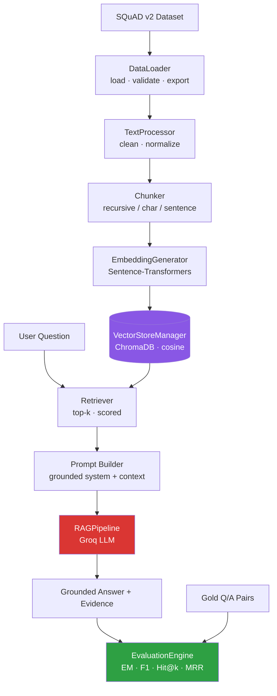

<!--
Title: README
Description: Project overview, architecture, and per-phase documentation for the
             Full RAG Pipeline project (SQuAD v2 · ChromaDB · Groq · Streamlit).
Responsibilities:
  - Explain the project purpose and architecture.
  - Document every implemented pipeline layer (Phases 3–9).
  - Track documentation growth across implementation phases.
Author: Aml
-->

# Full RAG Pipeline using SQuAD v2 Dataset with Groq LLM and Streamlit

## Project Overview

This project is a production-oriented, educational **Retrieval-Augmented
Generation (RAG)** system over the **SQuAD v2** dataset. It retrieves supporting
evidence from a vector database and grounds a Groq-hosted LLM in that evidence,
refusing to answer when the retrieved context is insufficient — exactly the
answerable / unanswerable behaviour SQuAD v2 was designed to test.

The codebase is organised as a clean, layered, **framework-agnostic** package
under `src/`, where every layer is independently unit-tested and wired together
through dependency injection. A separate, self-contained Streamlit demo
("The Archive") and a demonstration notebook live at the project root.

**Current status:** Phases 1–9 are complete — project scaffold, configuration,
data loading, text processing, chunking, embeddings, vector store, retrieval,
prompt + pipeline orchestration, and evaluation. The full test suite passes
(`126 passed, 1 skipped`) with zero lint findings.

## Features

- ✅ Dataset ingestion & validation (SQuAD v2 via Hugging Face, with caching)
- ✅ Conservative text cleaning & Unicode normalisation
- ✅ Configurable chunking (recursive / character / sentence strategies)
- ✅ Dense embeddings (Sentence-Transformers, `BAAI/bge-small-en-v1.5`)
- ✅ Persistent Chroma vector store (cosine space)
- ✅ Scored similarity retrieval with top-k & similarity filtering
- ✅ Grounded prompt engineering with a fixed refusal phrase
- ✅ End-to-end RAG orchestration over the Groq SDK (free tier, no credit card)
- ✅ SQuAD-style evaluation (Exact Match, token-F1, Hit@k, MRR, refusal metrics)
- ✅ Centralised logging, full pytest coverage, ruff linting & formatting
- 🚧 Streamlit UI binding to the `src/` package (Phase 10)
- 🚧 Final documentation pass & demo notebooks (Phase 11)

## Architecture

