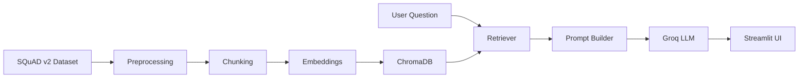

# Full RAG Pipeline using SQuAD v2 Dataset with Groq LLM and Streamlit

> **Title:** README
> **Description:** Project overview and setup guide for the Full RAG Pipeline project.
> **Responsibilities:**
>
> - Explain the project purpose.
> - Document setup and usage.
> - Track documentation growth across implementation phases.
>
> **Author:** Author Placeholder

## Project Overview

This project is a production-oriented educational Retrieval-Augmented Generation
system using the SQuAD v2 dataset, ChromaDB, Groq, and Streamlit.

Phase 1 initializes the professional project structure. The original workspace
did not contain implementation files, so no application logic was changed.

## Planned Features

- Dataset preprocessing
- Text chunking
- Embedding generation
- Chroma vector database
- Similarity retrieval
- Prompt engineering
- Groq LLM integration
- Streamlit application
- Evaluation and benchmarking
- Logging, tests, linting, and documentation

## Architecture

